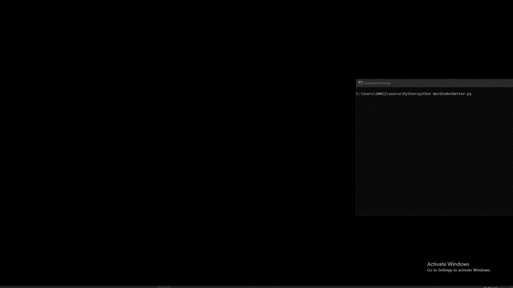

# Wordle-Bot
A python script that guesses the Wordle correctly

This bot uses Selenium to open a browser window to [Wordle](https://www.powerlanguage.co.uk/wordle/) and interact with the site.
From the results of the first guess, it removes any invalid answers and makes the next guess that will narrow down the list the most.

Using "farts" as a first guess, it gets the answer correct within all 6 tries 97% of the time.

